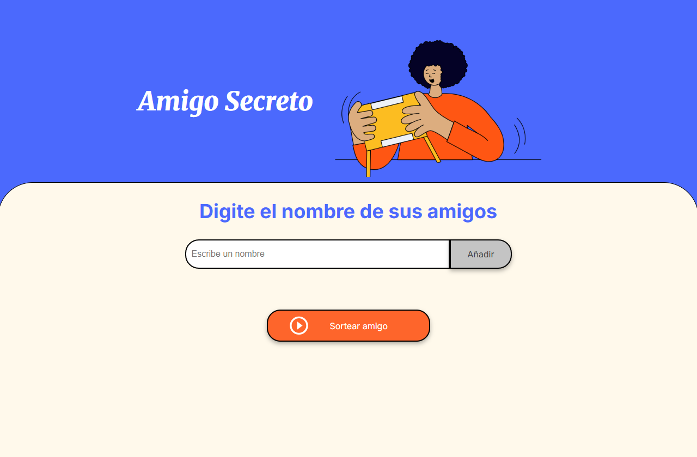
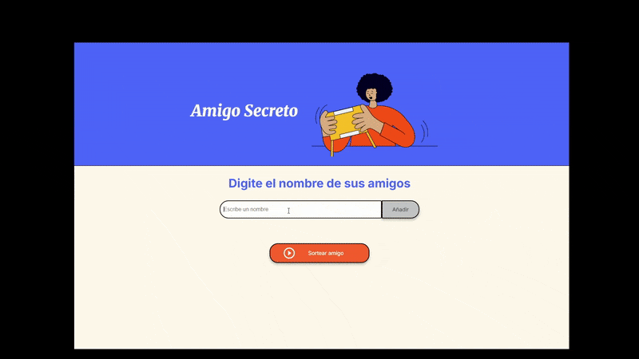

# 🎁 Challenge-Amigo Secreto

## ✨ Descripción
¡Bienvenido al **Challenge- Amigo Secreto**!  
Esta es una aplicación web simple que permite a los usuarios ingresar nombres de amigos en una lista y luego realizar un **sorteo aleatorio** para determinar quién es el "amigo secreto".

Los usuarios pueden:  
- Agregar nombres mediante un campo de texto y un botón **"Añadir"**  
- Visualizar todos los nombres ingresados en una lista  
- Sortear un amigo secreto con solo un clic en **"Sortear amigo"**

---



## 🛠️ Funcionalidades
- **Agregar nombres:** Los usuarios escriben un nombre y lo agregan a la lista.  
- **Validar entrada:** Se asegura de que los nombres sean válidos y no estén vacíos o duplicados.  
- **Visualizar la lista:** Todos los amigos ingresados se muestran en tiempo real.  
- **Sorteo aleatorio:** Selecciona un nombre al azar de la lista y lo muestra en pantalla.  
- **Máximo de amigos:** Hasta 100 nombres por sorteo.  
- **Interfaz amigable:** Botones deshabilitados hasta que haya suficientes amigos para sortear.

---



## 💻 Tecnologías utilizadas
- HTML  
- CSS  
- JavaScript  

---

## 🚀 Instalación y uso
1. Clonar este repositorio:
   ```bash
   git clone https://github.com/keylor24/challenge-amigo-secreto.git

2. Abrir el proyecto en tu editor de código:
    ```bash
    code .

3. Abrir index.html en tu navegador favorito.
4. ¡Listo! Puedes empezar a agregar nombres y sortear a tus amigos.


🧑‍💻 Autor

Keylor B – Proyecto personal desarrollado en Programa AluraLatam-ONE.